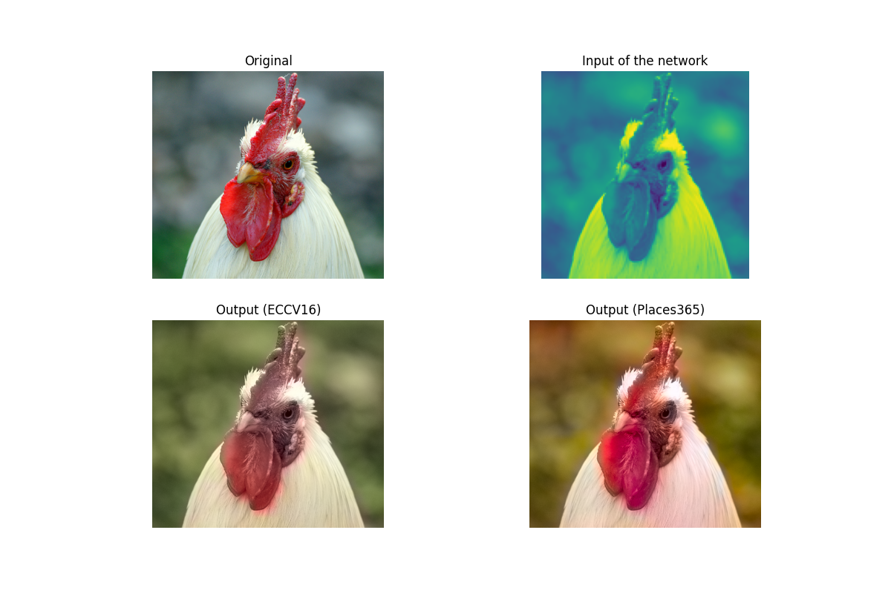
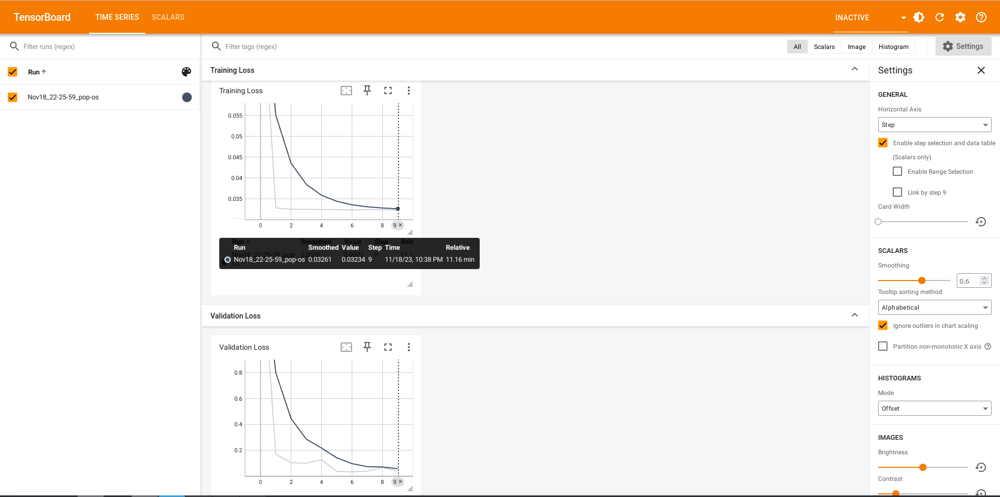

<!--<h3><b>Colorful Image Colorization</b></h3>-->
## <b>Colorful Image Colorization</b> [[Project Page]](http://richzhang.github.io/colorization/) <br>

For an imageprocessing SSL problem, we choosed the colorisation, and we used the paper and code of the following authores:

[Richard Zhang](https://richzhang.github.io/), [Phillip Isola](http://web.mit.edu/phillipi/), [Alexei A. Efros](http://www.eecs.berkeley.edu/~efros/). In [ECCV, 2016](http://arxiv.org/pdf/1603.08511.pdf).

For comparing the results with another dataset, we choosed the [Places365](http://places.csail.mit.edu/) dataset, because it's similar in size and complexity, but it is different from the Imagenet.

**Challenges**

We faced two challenges during the development: on the one hand, the publication did not contain the teaching code, it could only be evaluated, so we had to develop a pipeline that was compatible with the original. On the other hand, the Places365 dataset was quite large, and we had an Nvidia 3050 card for teaching, so we had to do a significant optimization to fit into the video memory. The resolution had to be down to 128, so an epoch of 3.5 h, at least 10 epochs were needed.

**Clone the repository; install dependencies**

```
git clone https://github.com/tamarci/DeepLearningHW23.git
cd ./DeepLearningHW23/colorization
conda create -n clor --file requirements.txt
conda activate clor
```

**Colorize!** This script will colorize an image, and will plot four images: the original, the grayscaled, our result based on the Places365 dataset, and the original result trained on the Imagenet version.

```
python evaluate.py -i imgs/ansel_adams3.jpg
```



**Training** The following commands train the model on the Places365 dataset. Warning! The model requires quite big dataspace, around 200GB. Originally it has a ./imgs/places365 folder, which contains only 10 images, you should remove it before training

```python
# To let the program download the dataset, just remove the empty folder:
# rm -rf ./imgs/places365
python train.py
```

### Results so far
You can check the train_loss and the validation_loss via tensorboard just run:

```python
tensorboard --logdir_runs
```

Opening in your browser this link: http://localhost:6006/, you should see something like this:



Our best model is at the following [link](https://drive.google.com/drive/folders/12I7s6N5d8JGZ9MgK6pJQTd0noXoH8Z7U?usp=sharing).

### Benchmarking

We have splitted the model, freezed the weights and merged with the ResNet50, to improve its ability. For benchmarking, we used the [Fair SSL Benchmark](https://github.com/facebookresearch/fair_self_supervision_benchmark), it was once again a challenge to run it in a usefull time in our poor 3050 (the original one was running on 8 GPU :c).


