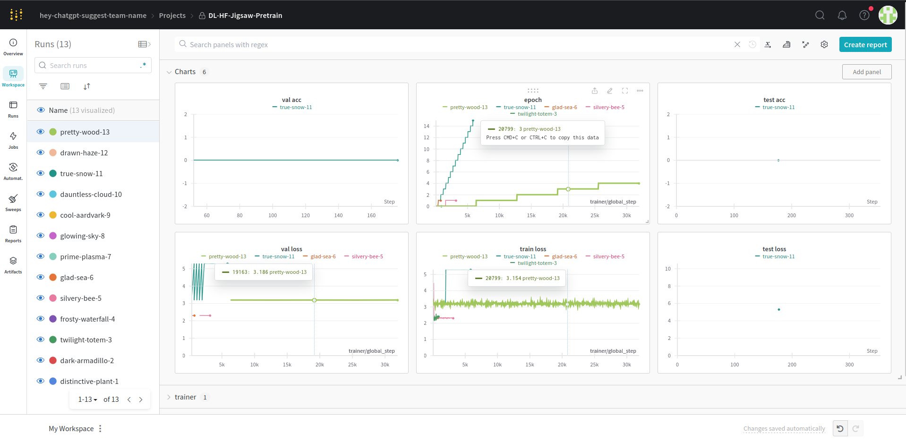
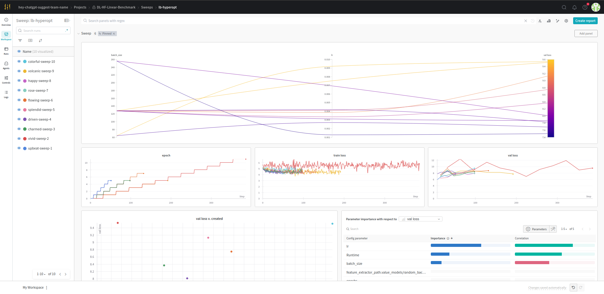
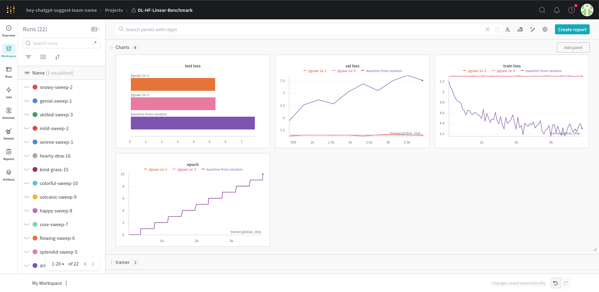

# Linear benchmark evaluation of the Jigsaw task

## Motivation

After trying and experimenting with the VISSL framework, we failed to start meaningful training on the Jigsaw task due to technical factors. Thus, we wanted to implement the whole procedure (pretrain+linear benchmark evaluation) on our own, giving us the ability to experiment and tailor, cut back on data and model size.

## Design choices and implementation

Our chosen pretraining was the Jigsaw self-supervised task. In the originally formulated way, it consists of cropping a section of the image, dividing into 3x3 tiles (the "jigsaw pieces"), then generating a random permutation of the 9 tiles, and batching them (9xWxH) to the input of the model. The expected output is the ordinal of the permutation used (the identity permutation is the first, the [1, 2, ..., 6, 7, 9, 8] is the second etc. up until the 9!-th index), thus making it a classification problem with respect to the random-chosen permutation.

For practical purposes, the classification is not aimed at all the 9! possible permutations, but a subset of them, so there is (mostly) an 1000-permutation and a 100-permutation variant discussed in the original paper. In our experiments, when using a 3x3 division (`N_TILES`), both the 1000 and 100 permutation version was  technically infeasible, prompting us to experiment with a 10-permutation subset instead, but also trying a 2x2 tile division with all 24 possible permutations.

The original paper used the PASCAL VOC and ImageNet datasets, but due to our aims of pretraining on non-ImageNet related, non-object-centric datasets, we have chosen Places365 as a more scene-centric dataset. Because the whole train split consists of over 100GB of images, we have limited ourselves to the validation split, 36000 images, that we used as a base, and divided into train, validation and test sets. The fact that we could not technically pretrain on big enough datasets (nowhere near the size of PASCAL VOC, ImageNet or even the whole Places365, having milions of images) may have caused the poor performance seen later, but it nonetheless validated the pipeline itself.

The original model propsed in https://arxiv.org/abs/1603.09246, the Context Free Network consists of a shared convolutional backbone applied upon each jigsaw piece (tile), followed by a per-tile fully connected layer, then concatenated the outputs and fed it into a final fully connected layer for classification. This was implemented in [this](https://github.com/bbrattoli/JigsawPuzzlePytorch/tree/master) repository in 2017, for Python 2.7, we chose to adapt it for our own implementations, creating a smaller version of it (an extra degree of freedom compared to the VISSL framework approach) with three convolutional blocks of 96, 256 and 384 filters (customizable in the code), a per-tile fully connected layer of 1024 neurons and a global fully connected layer of 256 neurons, followed by the fully connected classification head of choice (10 or 24 classes). This down-parameterization (about 40M parameters, but still way less than the original paper suggests) that were made due to technical limitations also cut back the capabilities of the model.

In the definition above, we defined the convolutional and per-tile fully connected layers as the *feature extractor*, that was saved after the pretraining and loaded for linear benchmark evaluation.

The linear benchmark evaluation code consists of loading and freezing the pretrained weights, putting on it a fully connected classification layer and nothing else, then training for said task. We chose the Tiny ImageNet dataset for that, with 200 classes.

Finally, we created a proof of concept hyperparameter optimization using WandB Sweeps for the later stage (but which can be easily extended to the pretraining itself, but it was not feasible hardware-wise), using WandB Sweeps. For the rest of the code, we used the Torch and Lightning libraries for ease of prototyping.

## Experiments


Practically, we only could experiment on very limited data, a limited task and a smaller model (around 40M parameters), without promising prospects. Based on the original implementation, but adding some improvements like batch normalization (that was implemented then), we used Adam optimizer with learning rates between 0.001 and 0.01, varying batch sizes and convolutional filter numbers to a limited degree. Both train and test performance locked in at around **3.08 cross entropy**, and negligible accuracy. Probably due to the interplay of technical difficulties and limitations, we could not create a truly impressive training. Experiments logged to WandB can be seen below:


On the downstream task of classification as linear benchmark evaluation, the results of the hyperparameter optimization can be seen here, suggesting higher batch sizes (256), but lower learning rates (0.001) provide the best evaluation scenarios:



We have also compared the pretrained feature extractor to a random-initialized, frozen version of the same architecture on the downstream task. We experienced that the former provided a backbone that could improve performance on train data, but did not generalize well because of the high number of degrees of freedom, while the later (actually pretrained version) had basically the same preformance from beginning to end (slightly better on validation data than the random), but not improving on the train set at all, suggesting that the pretrained weights created a skewed, but "stable" mapping of the input features. This suggests that the jigsaw task is not a good pretraining procedure considering our tech budget and scope. Comparison can be seen below:




## Running with Docker (recommended)

Change your working directory to the current (`jigsaw`) folder in the repo. Then to build the image and run the container:

```
docker build -t {IMAGE_NAME} .
docker run --rm --gpus all -it jigsaw
```
This leaves you in the interactive terminal of the environment. To run a baseline version of the pretraining routines, the linear benchmark evaluation, and the hyperparameter optimization run either
```
/usr/bin/python3 train_and_evaluate.py pretrain_and_benchmark
```
or
```
/usr/bin/python3 train_and_evaluate.py hyperopt
```
Additionally, providing `--model_path` (default: `models/jigsaw_10_1024.pth`) lets you specify where to save the feature extractor portion of the model.


Running either will download the datasets (the validation set of the Places365 - not the train split, because that is cca. 100 GB, the Tiny Imagenet dataset) into the container's local file system, and a prompt will ask for your API key at WandB to track runs. After successful authentication, the appropriate action starts.

The `pretrain_and_benchmark` action (it is advised to run this first, to have a saved feature extractor on which the hyperopt step is based):
1. Trains a model on the self-supervised jigsaw task, using a 70-15-15 train-val-test split of the Places365 validation dataset, while logging the results to WandB.
2. Saves the feature extractor portion of the model
3. Runs the linear benchmark evaluation, by loading the feature extractor, placing a single classifier linear layer on top of it, and training only the linear weights for the classification task. This is performed on the Tiny ImageNet dataset, that provides 200 image classes.

The `hyperopt` action (it is advised to run after the above) performs hyperparameter optimization on step 3 from above, attempting to pinpoint the optimal learning rate and batch parameters to run the linear benchmark evaluation upon, thus assessing the pretrained feature extractor "at its best". Due to hardware and time constraints, we only ran the hyperparameter optimization os this step, to demonstrate its capabilities, but based on the code, it can be easily expanded to step 1, by trying different configurations of the model itself (setting global variables `CONV{i}_C`, `FC{i}` etc.). The optimization itself is done via WandB Sweeps.


## How to configure

Going beyond the basic configuration of the functionalities described above, various model and training parameters can be customized by editing the global variabes of `train_and_evaluate.py` (right after the imports) before running the Docker build. This includes the sizes of the convolutional backbone, the number of neurons in the fully connected layers, but the pretrain task too, to some extent (the numer of tile divisions, e.g. 2 by 2, 3 by 3 - the default - can be set via `N_TILES`). We chose this customization option of editing global variables over cluttering the CLI interface of the script.

File and folder dependencies (the files and folders that should exist before starting the script) are either readily available in the repository, or created during the Docker build. File output (where to save the weights of the feature extractor) can be set via `--model_path`, datasets will also be downloaded locally to the conatiner's filesystem on first run.

The basic usage might run out of CPU or GPU memory, or overload the CPU. In this case, performance parameters (like the `num_workers`, `batch_size`) should be overwritten in the appropriate functions (`pretrain_and_save`, `load_feature_extractor_and_evaluate`, `linear_benchmark_evaluation_with_sweeps`, `fit_sweep`, generally where data and model objects are being instantiated).